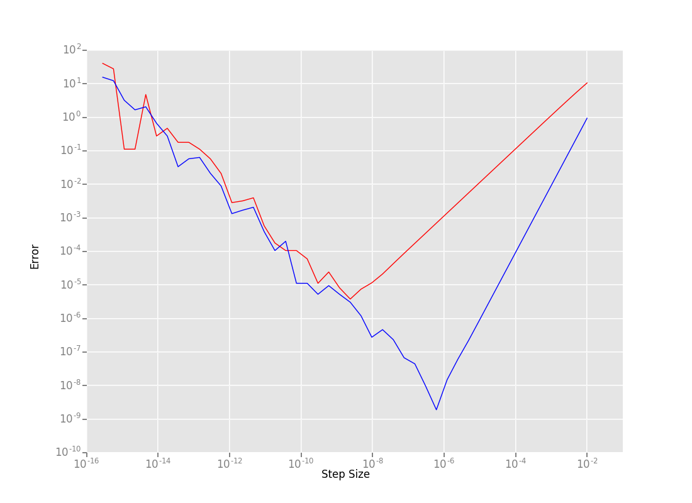
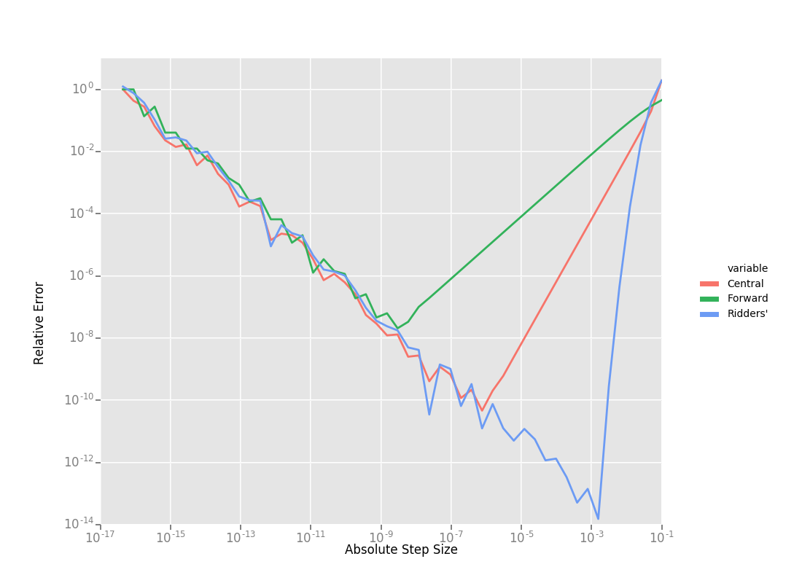

.. default-domain:: cpp

.. cpp:namespace:: ceres

.. _chapter-on_derivatives:

==============
On Derivatives
==============

.. _section-introduction:

Introduction
============

Ceres Solver, like all gradient based optimization algorithms, depends
on being able to evaluate the objective function and its derivatives
at arbitrary points in its domain. Indeed, defining the objective
function and its `Jacobian
<https://en.wikipedia.org/wiki/Jacobian_matrix_and_determinant>`_ is
the principal task that the user is required to perform when solving
an optimization problem using Ceres Solver. The correct and efficient
computation of the Jacobian is the key to good performance.

Ceres Solver offers considerable flexibility in how the user can
provide derivatives to the solver. She can use:

 1. :ref:`section-analytic_derivatives`: The user figures out the
    derivatives herself, by hand or using a tool like
    `Maple <https://www.maplesoft.com/products/maple/>`_ or
    `Mathematica <https://www.wolfram.com/mathematica/>`_, and
    implements them in a :class:`CostFunction`.
 2. :ref:`section-numerical_derivatives`: Ceres numerically computes
    the derivative using finite differences.
 3. :ref:`section-automatic_derivatives`: Ceres automatically computes
    the analytic derivative.

Which of these three approaches (alone or in combination) should be
used depends on the situation and the tradeoffs the user is willing to
make. Unfortunately, numerical optimization textbooks rarely discuss
these issues in detail and the user is left to her own devices.

The aim of this article is to fill this gap and describe each of these
three approaches in the context of Ceres Solver with sufficient detail
that the user can make an informed choice.

High Level Advice
-----------------

For the impatient amongst you, here is some high level advice:

 1. Use :ref:`section-automatic_derivatives`.
 2. In some cases it maybe worth using
    :ref:`section-analytic_derivatives`.
 3. Avoid :ref:`section-numerical_derivatives`. Use it as a measure of
    last resort, mostly to interface with external libraries.

.. _section-spivak_notation:

Spivak Notation
===============

To preserve our collective sanities, we will use Spivak's notation for
derivatives. It is a functional notation that makes reading and
reasoning about expressions involving derivatives simple.

For a univariate function :math:`f`, :math:`f(a)` denotes its value at
:math:`a`. :math:`Df` denotes its first derivative, and
:math:`Df(a)` is the derivative evaluated at :math:`a`, i.e

.. math::
   Df(a) = \left . \frac{d}{dx} f(x) \right |_{x = a}

:math:`D^nf` denotes the :math:`n^{\text{th}}` derivative of :math:`f`.

For a bi-variate function :math:`g(x,y)`. :math:`D_1g` and
:math:`D_2g` denote the partial derivatives of :math:`g` w.r.t the
first and second variable respectively. In the classical notation this
is equivalent to saying:

.. math::

   D_1 g = \frac{\partial}{\partial x}g(x,y) \text{ and }  D_2 g  = \frac{\partial}{\partial y}g(x,y).

:math:`Dg` denotes the Jacobian of `g`, i.e.,

.. math::

  Dg = \begin{bmatrix} D_1g & D_2g \end{bmatrix}

More generally for a multivariate function :math:`g:\mathbb{R}^m
\rightarrow \mathbb{R}^n`, :math:`Dg` denotes the :math:`n\times m`
Jacobian matrix. :math:`D_i g` is the partial derivative of :math:`g`
w.r.t the :math:`i^{\text{th}}` coordinate and the
:math:`i^{\text{th}}` column of :math:`Dg`.

Finally, :math:`D^2_1g, D_1D_2g` have the obvious meaning as higher
order partial derivatives derivatives.

For more see Michael Spivak's book `Calculus on Manifolds
<https://www.amazon.com/Calculus-Manifolds-Approach-Classical-Theorems/dp/0805390219>`_
or a brief discussion of the `merits of this notation
<http://www.vendian.org/mncharity/dir3/dxdoc/>`_ by
Mitchell N. Charity.

.. _section-analytic_derivatives:

Analytic Derivatives
====================

Consider the problem of fitting the following curve (`Rat43
<http://www.itl.nist.gov/div898/strd/nls/data/ratkowsky3.shtml>`_) to
data:

.. math::
  y = \frac{b_1}{(1+e^{b_2-b_3x})^{1/b_4}}

That is, given some data :math:`\{x_i, y_i\},\ \forall i=1,... ,n`,
determine parameters :math:`b_1, b_2, b_3` and :math:`b_4` that best
fit this data.

Which can be stated as the problem of finding the
values of :math:`b_1, b_2, b_3` and :math:`b_4` are the ones that
minimize the following objective function [#f1]_:

.. math::
   \begin{align}
   E(b_1, b_2, b_3, b_4)
   &= \sum_i f^2(b_1, b_2, b_3, b_4 ; x_i, y_i)\\
   &= \sum_i \left(\frac{b_1}{(1+e^{b_2-b_3x_i})^{1/b_4}} - y_i\right)^2\\
   \end{align}

To solve this problem using Ceres Solver, we need to define a
:class:`CostFunction` that computes the residual :math:`f` for a given
:math:`x` and :math:`y` and its derivatives with respect to
:math:`b_1, b_2, b_3` and :math:`b_4`.

Using elementary differential calculus, we can see that:

.. math::
  \begin{align}
  D_1 f(b_1, b_2, b_3, b_4; x,y) &= \frac{1}{(1+e^{b_2-b_3x})^{1/b_4}}\\
  D_2 f(b_1, b_2, b_3, b_4; x,y) &=
  \frac{-b_1e^{b_2-b_3x}}{b_4(1+e^{b_2-b_3x})^{1/b_4 + 1}} \\
  D_3 f(b_1, b_2, b_3, b_4; x,y) &=
  \frac{b_1xe^{b_2-b_3x}}{b_4(1+e^{b_2-b_3x})^{1/b_4 + 1}} \\
  D_4 f(b_1, b_2, b_3, b_4; x,y) & = \frac{b_1  \log\left(1+e^{b_2-b_3x}\right) }{b_4^2(1+e^{b_2-b_3x})^{1/b_4}}
  \end{align}

With these derivatives in hand, we can now implement the
:class:`CostFunction` as:

.. code-block:: c++

  class Rat43Analytic : public SizedCostFunction<1,4> {
     public:
       Rat43Analytic(const double x, const double y) : x_(x), y_(y) {}
       virtual ~Rat43Analytic() {}
       virtual bool Evaluate(double const* const* parameters,
                             double* residuals,
			     double** jacobians) const {
	 const double b1 = parameters[0][0];
	 const double b2 = parameters[0][1];
	 const double b3 = parameters[0][2];
	 const double b4 = parameters[0][3];

	 residuals[0] = b1 *  pow(1 + exp(b2 -  b3 * x_), -1.0 / b4) - y_;

         if (!jacobians) return true;
	 double* jacobian = jacobians[0];
	 if (!jacobian) return true;

         jacobian[0] = pow(1 + exp(b2 - b3 * x_), -1.0 / b4);
         jacobian[1] = -b1 * exp(b2 - b3 * x_) *
                       pow(1 + exp(b2 - b3 * x_), -1.0 / b4 - 1) / b4;
	 jacobian[2] = x_ * b1 * exp(b2 - b3 * x_) *
                       pow(1 + exp(b2 - b3 * x_), -1.0 / b4 - 1) / b4;
         jacobian[3] = b1 * log(1 + exp(b2 - b3 * x_)) *
                       pow(1 + exp(b2 - b3 * x_), -1.0 / b4) / (b4 * b4);
         return true;
       }

      private:
       const double x_;
       const double y_;
   };

This is tedious code, hard to read and with a lot of
redundancy. So in practice we will cache some sub-expressions to
improve its efficiency, which would give us something like:

.. code-block:: c++

  class Rat43AnalyticOptimized : public SizedCostFunction<1,4> {
     public:
       Rat43AnalyticOptimized(const double x, const double y) : x_(x), y_(y) {}
       virtual ~Rat43AnalyticOptimized() {}
       virtual bool Evaluate(double const* const* parameters,
                             double* residuals,
			     double** jacobians) const {
	 const double b1 = parameters[0][0];
	 const double b2 = parameters[0][1];
	 const double b3 = parameters[0][2];
	 const double b4 = parameters[0][3];

	 const double t1 = exp(b2 -  b3 * x_);
         const double t2 = 1 + t1;
	 const double t3 = pow(t2, -1.0 / b4);
	 residuals[0] = b1 * t3 - y_;

         if (!jacobians) return true;
	 double* jacobian = jacobians[0];
	 if (!jacobian) return true;

	 const double t4 = pow(t2, -1.0 / b4 - 1);
	 jacobian[0] = t3;
	 jacobian[1] = -b1 * t1 * t4 / b4;
	 jacobian[2] = -x_ * jacobian[1];
	 jacobian[3] = b1 * log(t2) * t3 / (b4 * b4);
	 return true;
       }

     private:
       const double x_;
       const double y_;
   };

What is the difference in performance of these two implementations?

==========================   =========
CostFunction                 Time (ns)
==========================   =========
Rat43Analytic                      255
Rat43AnalyticOptimized              92
==========================   =========

``Rat43AnalyticOptimized`` is :math:`2.8` times faster than
``Rat43Analytic``.  This difference in run-time is not uncommon. To
get the best performance out of analytically computed derivatives, one
usually needs to optimize the code to account for common
sub-expressions.

When should you use analytical derivatives?
-------------------------------------------

#. The expressions are simple, e.g. mostly linear.

#. A computer algebra system like `Maple
   <https://www.maplesoft.com/products/maple/>`_ , `Mathematica
   <https://www.wolfram.com/mathematica/>`_, or `SymPy
   <http://www.sympy.org/en/index.html>`_ can be used to symbolically
   differentiate the objective function and generate the C++ to
   evaluate them.

#. Performance is of utmost concern and there is algebraic structure
   in the terms that you can exploit to get better performance than
   automatic differentiation.

   That said, getting the best performance out of analytical
   derivatives requires a non-trivial amount of work.  Before going
   down this path, it is useful to measure the amount of time being
   spent evaluating the Jacobian as a fraction of the total solve time
   and remember `Amdahl's Law
   <https://en.wikipedia.org/wiki/Amdahl's_law>`_ is your friend.

#. There is no other way to compute the derivatives, e.g. you
   wish to compute the derivative of the root of a polynomial:

   .. math::
     a_3(x,y)z^3 + a_2(x,y)z^2 + a_1(x,y)z + a_0(x,y) = 0

   with respect to :math:`x` and :math:`y`. This requires the use of
   the `Inverse Function Theorem
   <https://en.wikipedia.org/wiki/Inverse_function_theorem>`_

#. You love the chain rule and actually enjoy doing all the algebra by
   hand.

.. _section-numerical_derivatives:

Numeric derivatives
===================

The other extreme from using analytic derivatives is to use numeric
derivatives. The key observation here is that the process of
differentiating a function :math:`f(x)` w.r.t :math:`x` can be written
as the limiting process:

.. math::
   Df(x) = \lim_{h \rightarrow 0} \frac{f(x + h) - f(x)}{h}

Forward Differences
-------------------

Now of course one cannot perform the limiting operation numerically on
a computer so we do the next best thing, which is to choose a small
value of :math:`h` and approximate the derivative as

.. math::
   Df(x) \approx \frac{f(x + h) - f(x)}{h}

The above formula is the simplest most basic form of numeric
differentiation. It is known as the *Forward Difference* formula.

So how would one go about constructing a numerically differentiated
version of ``Rat43Analytic`` in Ceres Solver. This is done in two
steps:

  1. Define *Functor* that given the parameter values will evaluate the
     residual for a given :math:`(x,y)`.
  2. Construct a :class:`CostFunction` by using
     :class:`NumericDiffCostFunction` to wrap an instance of
     ``Rat43CostFunctor``.

.. code-block:: c++

  struct Rat43CostFunctor {
    Rat43CostFunctor(const double x, const double y) : x_(x), y_(y) {}

    bool operator()(const double* parameters, double* residuals) const {
      const double b1 = parameters[0];
      const double b2 = parameters[1];
      const double b3 = parameters[2];
      const double b4 = parameters[3];
      residuals[0] = b1 * pow(1.0 + exp(b2 -  b3 * x_), -1.0 / b4) - y_;
      return true;
    }

    const double x_;
    const double y_;
  }

  CostFunction* cost_function =
    new NumericDiffCostFunction<Rat43CostFunctor, FORWARD, 1, 4>(
      new Rat43CostFunctor(x, y));

This is about the minimum amount of work one can expect to do to
define the cost function. The only thing that the user needs to do is
to make sure that the evaluation of the residual is implemented
correctly and efficiently.

Before going further, it is instructive to get an estimate of the
error in the forward difference formula. We do this by considering the
`Taylor expansion <https://en.wikipedia.org/wiki/Taylor_series>`_ of
:math:`f` near :math:`x`.

.. math::
   \begin{align}
   f(x+h) &= f(x) + h Df(x) + \frac{h^2}{2!} D^2f(x) +
   \frac{h^3}{3!}D^3f(x) + \cdots \\
   Df(x) &= \frac{f(x + h) - f(x)}{h} - \left [\frac{h}{2!}D^2f(x) +
   \frac{h^2}{3!}D^3f(x) + \cdots  \right]\\
   Df(x) &= \frac{f(x + h) - f(x)}{h} + O(h)
   \end{align}

i.e., the error in the forward difference formula is
:math:`O(h)` [#f4]_.

Implementation Details
^^^^^^^^^^^^^^^^^^^^^^

:class:`NumericDiffCostFunction` implements a generic algorithm to
numerically differentiate a given functor. While the actual
implementation of :class:`NumericDiffCostFunction` is complicated, the
net result is a :class:`CostFunction` that roughly looks something
like the following:

.. code-block:: c++

  class Rat43NumericDiffForward : public SizedCostFunction<1,4> {
     public:
       Rat43NumericDiffForward(const Rat43Functor* functor) : functor_(functor) {}
       virtual ~Rat43NumericDiffForward() {}
       virtual bool Evaluate(double const* const* parameters,
                             double* residuals,
			     double** jacobians) const {
 	 functor_(parameters[0], residuals);
	 if (!jacobians) return true;
	 double* jacobian = jacobians[0];
	 if (!jacobian) return true;

	 const double f = residuals[0];
	 double parameters_plus_h[4];
	 for (int i = 0; i < 4; ++i) {
	   std::copy(parameters, parameters + 4, parameters_plus_h);
	   const double kRelativeStepSize = 1e-6;
	   const double h = std::abs(parameters[i]) * kRelativeStepSize;
	   parameters_plus_h[i] += h;
           double f_plus;
  	   functor_(parameters_plus_h, &f_plus);
	   jacobian[i] = (f_plus - f) / h;
         }
	 return true;
       }

     private:
       scoped_ptr<Rat43Functor> functor_;
   };

Note the choice of step size :math:`h` in the above code, instead of
an absolute step size which is the same for all parameters, we use a
relative step size of :math:`\text{kRelativeStepSize} = 10^{-6}`. This
gives better derivative estimates than an absolute step size [#f2]_
[#f3]_. This choice of step size only works for parameter values that
are not close to zero. So the actual implementation of
:class:`NumericDiffCostFunction`, uses a more complex step size
selection logic, where close to zero, it switches to a fixed step
size.

Central Differences
-------------------

:math:`O(h)` error in the Forward Difference formula is okay but not
great. A better method is to use the *Central Difference* formula:

.. math::
   Df(x) \approx \frac{f(x + h) - f(x - h)}{2h}

Notice that if the value of :math:`f(x)` is known, the Forward
Difference formula only requires one extra evaluation, but the Central
Difference formula requires two evaluations, making it twice as
expensive. So is the extra evaluation worth it?

To answer this question, we again compute the error of approximation
in the central difference formula:

.. math::
   \begin{align}
  f(x + h) &= f(x) + h Df(x) + \frac{h^2}{2!}
  D^2f(x) + \frac{h^3}{3!} D^3f(x) + \frac{h^4}{4!} D^4f(x) + \cdots\\
    f(x - h) &= f(x) - h Df(x) + \frac{h^2}{2!}
  D^2f(x) - \frac{h^3}{3!} D^3f(c_2) + \frac{h^4}{4!} D^4f(x) +
  \cdots\\
  Df(x) & =  \frac{f(x + h) - f(x - h)}{2h} + \frac{h^2}{3!}
  D^3f(x) +  \frac{h^4}{5!}
  D^5f(x) + \cdots \\
  Df(x) & =  \frac{f(x + h) - f(x - h)}{2h} + O(h^2)
   \end{align}

The error of the Central Difference formula is :math:`O(h^2)`, i.e.,
the error goes down quadratically whereas the error in the Forward
Difference formula only goes down linearly.

Using central differences instead of forward differences in Ceres
Solver is a simple matter of changing a template argument to
:class:`NumericDiffCostFunction` as follows:

.. code-block:: c++

  CostFunction* cost_function =
    new NumericDiffCostFunction<Rat43CostFunctor, CENTRAL, 1, 4>(
      new Rat43CostFunctor(x, y));

But what do these differences in the error mean in practice? To see
this, consider the problem of evaluating the derivative of the
univariate function

.. math::
   f(x) = \frac{e^x}{\sin x - x^2},

at :math:`x = 1.0`.

It is straightforward to see that :math:`Df(1.0) =
140.73773557129658`. Using this value as reference, we can now compute
the relative error in the forward and central difference formulae as a
function of the absolute step size and plot them.

Reading the graph from right to left, a number of things stand out in
the above graph:

 1. The graph for both formulae have two distinct regions. At first,
    starting from a large value of :math:`h` the error goes down as
    the effect of truncating the Taylor series dominates, but as the
    value of :math:`h` continues to decrease, the error starts
    increasing again as roundoff error starts to dominate the
    computation. So we cannot just keep on reducing the value of
    :math:`h` to get better estimates of :math:`Df`. The fact that we
    are using finite precision arithmetic becomes a limiting factor.
 2. Forward Difference formula is not a great method for evaluating
    derivatives. Central Difference formula converges much more
    quickly to a more accurate estimate of the derivative with
    decreasing step size. So unless the evaluation of :math:`f(x)` is
    so expensive that you absolutely cannot afford the extra
    evaluation required by central differences, **do not use the
    Forward Difference formula**.
 3. Neither formula works well for a poorly chosen value of :math:`h`.

Ridders' Method
---------------
So, can we get better estimates of :math:`Df` without requiring such
small values of :math:`h` that we start hitting floating point
roundoff errors?

One possible approach is to find a method whose error goes down faster
than :math:`O(h^2)`. This can be done by applying `Richardson
Extrapolation
<https://en.wikipedia.org/wiki/Richardson_extrapolation>`_ to the
problem of differentiation. This is also known as *Ridders' Method*
[Ridders]_.

Let us recall, the error in the central differences formula.

.. math::
   \begin{align}
   Df(x) & =  \frac{f(x + h) - f(x - h)}{2h} + \frac{h^2}{3!}
   D^3f(x) +  \frac{h^4}{5!}
   D^5f(x) + \cdots\\
           & =  \frac{f(x + h) - f(x - h)}{2h} + K_2 h^2 + K_4 h^4 + \cdots
   \end{align}

The key thing to note here is that the terms :math:`K_2, K_4, ...`
are indepdendent of :math:`h` and only depend on :math:`x`.

Let us now define:

.. math::

   A(1, m) = \frac{f(x + h/2^{m-1}) - f(x - h/2^{m-1})}{2h/2^{m-1}}.

Then observe that

.. math::

   Df(x) = A(1,1) + K_2 h^2 + K_4 h^4 + \cdots

and

.. math::

   Df(x) = A(1, 2) + K_2 (h/2)^2 + K_4 (h/2)^4 + \cdots

Here we have halved the step size to obtain a second central
differences estimate of :math:`Df(x)`. Combining these two estimates,
we get:

.. math::

   Df(x) = \frac{4 A(1, 2) - A(1,1)}{4 - 1} + O(h^4)

which is an approximation of :math:`Df(x)` with truncation error that
goes down as :math:`O(h^4)`. But we do not have to stop here. We can
iterate this process to obtain even more accurate estimates as
follows:

.. math::

   A(n, m) =  \begin{cases}
    \frac{\displaystyle f(x + h/2^{m-1}) - f(x -
    h/2^{m-1})}{\displaystyle 2h/2^{m-1}} & n = 1 \\
   \frac{\displaystyle 4^{n-1} A(n - 1, m + 1) - A(n - 1, m)}{\displaystyle 4^{n-1} - 1} & n > 1
   \end{cases}

It is straightforward to show that the approximation error in
:math:`A(n, 1)` is :math:`O(h^{2n})`. To see how the above formula can
be implemented in practice to compute :math:`A(n,1)` it is helpful to
structure the computation as the following tableau:

.. math::
   \begin{array}{ccccc}
   A(1,1) & A(1, 2) & A(1, 3) & A(1, 4) & \cdots\\
          & A(2, 1) & A(2, 2) & A(2, 3) & \cdots\\
	  &         & A(3, 1) & A(3, 2) & \cdots\\
	  &         &         & A(4, 1) & \cdots \\
	  &         &         &         & \ddots
   \end{array}

So, to compute :math:`A(n, 1)` for increasing values of :math:`n` we
move from the left to the right, computing one column at a
time. Assuming that the primary cost here is the evaluation of the
function :math:`f(x)`, the cost of computing a new column of the above
tableau is two function evaluations. Since the cost of evaluating
:math:`A(1, n)`, requires evaluating the central difference formula
for step size of :math:`2^{1-n}h`

Applying this method to :math:`f(x) = \frac{e^x}{\sin x - x^2}`
starting with a fairly large step size :math:`h = 0.01`, we get:

.. math::
   \begin{array}{rrrrr}
   141.678097131 &140.971663667 &140.796145400 &140.752333523 &140.741384778\\
   &140.736185846 &140.737639311 &140.737729564 &140.737735196\\
   & &140.737736209 &140.737735581 &140.737735571\\
   & & &140.737735571 &140.737735571\\
   & & & &140.737735571\\
   \end{array}

Compared to the *correct* value :math:`Df(1.0) = 140.73773557129658`,
:math:`A(5, 1)` has a relative error of :math:`10^{-13}`. For
comparison, the relative error for the central difference formula with
the same stepsize (:math:`0.01/2^4 = 0.000625`) is :math:`10^{-5}`.

The above tableau is the basis of Ridders' method for numeric
differentiation. The full implementation is an adaptive scheme that
tracks its own estimation error and stops automatically when the
desired precision is reached. Of course it is more expensive than the
forward and central difference formulae, but is also significantly
more robust and accurate.

Using Ridder's method instead of forward or central differences in
Ceres is again a simple matter of changing a template argument to
:class:`NumericDiffCostFunction` as follows:

.. code-block:: c++

  CostFunction* cost_function =
    new NumericDiffCostFunction<Rat43CostFunctor, RIDDERS, 1, 4>(
      new Rat43CostFunctor(x, y));

The following graph shows the relative error of the three methods as a
function of the absolute step size. For Ridders's method we assume
that the step size for evaluating :math:`A(n,1)` is :math:`2^{1-n}h`.

Using the 10 function evaluations that are needed to compute
:math:`A(5,1)` we are able to approximate :math:`Df(1.0)` about a 1000
times better than the best central differences estimate. To put these
numbers in perspective, machine epsilon for double precision
arithmetic is :math:`\approx 2.22 \times 10^{-16}`.

Going back to ``Rat43``, let us also look at the runtime cost of the
various methods for computing numeric derivatives.

==========================   =========
CostFunction                 Time (ns)
==========================   =========
Rat43Analytic                      255
Rat43AnalyticOptimized              92
Rat43NumericDiffForward            262
Rat43NumericDiffCentral            517
Rat43NumericDiffRidders           3760
==========================   =========

As expected, Central Differences is about twice as expensive as
Forward Differences and the remarkable accuracy improvements of
Ridders' method cost an order of magnitude more runtime.

Recommendations
---------------

Numeric differentiation should be used when you cannot compute the
derivatives either analytically or using automatic differention. This
is usually the case when you are calling an external library or
function whose analytic form you do not know or even if you do, you
are not in a position to re-write it in a manner required to use
automatic differentiation (discussed below).

When using numeric differentiation, use at least Central Differences,
and if execution time is not a concern or the objective function is
such that determining a good static relative step size is hard,
Ridders' method is recommended.

.. _section-automatic_derivatives:

Automatic Derivatives
=====================

We will now consider automatic differentiation. It is a technique that
can compute exact derivatives, fast, while requiring about the same
effort from the user as is needed to use numerical differentiation.

Don't believe me? Well here goes. The following code fragment
implements an automatically differentiated ``CostFunction`` for
``Rat43``.

.. code-block:: c++

  struct Rat43CostFunctor {
    Rat43CostFunctor(const double x, const double y) : x_(x), y_(y) {}

    template <typename T>
    bool operator()(const T* parameters, T* residuals) const {
      const T b1 = parameters[0];
      const T b2 = parameters[1];
      const T b3 = parameters[2];
      const T b4 = parameters[3];
      residuals[0] = b1 * pow(1.0 + exp(b2 -  b3 * x_), -1.0 / b4) - y_;
      return true;
    }

    private:
      const double x_;
      const double y_;
  };

  CostFunction* cost_function =
        new AutoDiffCostFunction<Rat43CostFunctor, 1, 4>(
	  new Rat43CostFunctor(x, y));

Notice that compared to numeric differentiation, the only difference
when defining the functor for use with automatic differentiation is
the signature of the ``operator()``.

In the case of numeric differentition it was

.. code-block:: c++

   bool operator()(const double* parameters, double* residuals) const;

and for automatic differentiation it is a templated function of the
form

.. code-block:: c++

   template <typename T> bool operator()(const T* parameters, T* residuals) const;

So what does this small change buy us? The following table compares
the time it takes to evaluate the residual and the Jacobian for
`Rat43` using various methods.

==========================   =========
CostFunction                 Time (ns)
==========================   =========
Rat43Analytic                      255
Rat43AnalyticOptimized              92
Rat43NumericDiffForward            262
Rat43NumericDiffCentral            517
Rat43NumericDiffRidders           3760
Rat43AutomaticDiff                 129
==========================   =========

We can get exact derivatives using automatic differentiation
(``Rat43AutomaticDiff``) with about the same effort that is required
to write the code for numeric differentiation but only :math:`40\%`
slower than hand optimized analytical derivatives.

So how does it work? For this we will have to learn about **Dual
Numbers** and **Jets** .

Dual Numbers & Jets
-------------------

.. NOTE::

   Reading this and the next section on implementing Jets is not
   necessary to use automatic differentiation in Ceres Solver. But
   knowing the basics of how Jets work is useful when debugging and
   reasoning about the performance of automatic differentiation.

Dual numbers are an extension of the real numbers analogous to complex
numbers: whereas complex numbers augment the reals by introducing an
imaginary unit :math:`\iota` such that :math:`\iota^2 = -1`, dual
numbers introduce an *infinitesimal* unit :math:`\epsilon` such that
:math:`\epsilon^2 = 0` . A dual number :math:`a + v\epsilon` has two
components, the *real* component :math:`a` and the *infinitesimal*
component :math:`v`.

Surprisingly, this simple change leads to a convenient method for
computing exact derivatives without needing to manipulate complicated
symbolic expressions.

For example, consider the function

.. math::

   f(x) = x^2 ,

Then,

.. math::

   \begin{align}
   f(10 + \epsilon) &= (10 + \epsilon)^2\\
            &= 100 + 20 \epsilon + \epsilon^2\\
            &= 100 + 20 \epsilon
   \end{align}

Observe that the coefficient of :math:`\epsilon` is :math:`Df(10) =
20`. Indeed this generalizes to functions which are not
polynomial. Consider an arbitrary differentiable function
:math:`f(x)`. Then we can evaluate :math:`f(x + \epsilon)` by
considering the Taylor expansion of :math:`f` near :math:`x`, which
gives us the infinite series

.. math::
   \begin{align}
   f(x + \epsilon) &= f(x) + Df(x) \epsilon + D^2f(x)
   \frac{\epsilon^2}{2} + D^3f(x) \frac{\epsilon^3}{6} + \cdots\\
   f(x + \epsilon) &= f(x) + Df(x) \epsilon
   \end{align}

Here we are using the fact that :math:`\epsilon^2 = 0`.

A `Jet <https://en.wikipedia.org/wiki/Jet_(mathematics)>`_ is a
:math:`n`-dimensional dual number, where we augment the real numbers
with :math:`n` infinitesimal units :math:`\epsilon_i,\ i=1,...,n` with
the property that :math:`\forall i, j\ \epsilon_i\epsilon_j = 0`. Then
a Jet consists of a *real* part :math:`a` and a :math:`n`-dimensional
*infinitesimal* part :math:`\mathbf{v}`, i.e.,

.. math::
   x = a + \sum_j v_{j} \epsilon_j

The summation notation gets tedius, so we will also just write

.. math::
   x = a + \mathbf{v}.

where the :math:`\epsilon_i`'s are implict. Then, using the same
Taylor series expansion used above, we can see that:

.. math::

  f(a + \mathbf{v}) = f(a) + Df(a) \mathbf{v}.

Similarly for a multivariate function
:math:`f:\mathbb{R}^{n}\rightarrow \mathbb{R}^m`, evaluated on
:math:`x_i = a_i + \mathbf{v}_i,\ \forall i = 1,...,n`:

.. math::
   f(x_1,..., x_n) = f(a_1, ..., a_n) + \sum_i D_i f(a_1, ..., a_n) \mathbf{v}_i

So if each :math:`\mathbf{v}_i = e_i` were the :math:`i^{\text{th}}`
standard basis vector, then, the above expression would simplify to

.. math::
   f(x_1,..., x_n) = f(a_1, ..., a_n) + \sum_i D_i f(a_1, ..., a_n) \epsilon_i

and we can extract the coordinates of the Jacobian by inspecting the
coefficients of :math:`\epsilon_i`.

Implementing Jets
^^^^^^^^^^^^^^^^^

In order for the above to work in practice, we will need the ability
to evaluate arbitrary function :math:`f` not just on real numbers but
also on dual numbers, but one does not usually evaluate functions by
evaluating their Taylor expansions,

This is where C++ templates and operator overloading comes into
play. The following code fragment has a simple implementation of a
``Jet`` and some operators/functions that operate on them.

.. code-block:: c++

   template<int N> struct Jet {
     double a;
     Eigen::Matrix<double, 1, N> v;
   };

   template<int N> Jet<N> operator+(const Jet<N>& f, const Jet<N>& g) {
     return Jet<N>(f.a + g.a, f.v + g.v);
   }

   template<int N> Jet<N> operator-(const Jet<N>& f, const Jet<N>& g) {
     return Jet<N>(f.a - g.a, f.v - g.v);
   }

   template<int N> Jet<N> operator*(const Jet<N>& f, const Jet<N>& g) {
     return Jet<N>(f.a * g.a, f.a * g.v + f.v * g.a);
   }

   template<int N> Jet<N> operator/(const Jet<N>& f, const Jet<N>& g) {
     return Jet<N>(f.a / g.a, f.v / g.a - f.a * g.v / (g.a * g.a));
   }

   template <int N> Jet<N> exp(const Jet<N>& f) {
     return Jet<T, N>(exp(f.a), exp(f.a) * f.v);
   }

   // This is a simple implementation for illustration purposes, the
   // actual implementation of pow requires careful handling of a number
   // of corner cases.
   template <int N>  Jet<N> pow(const Jet<N>& f, const Jet<N>& g) {
     return Jet<N>(pow(f.a, g.a),
                   g.a * pow(f.a, g.a - 1.0) * f.v +
		   pow(f.a, g.a) * log(f.a); * g.v);
   }

With these overloaded functions in hand, we can now call
``Rat43CostFunctor`` with an array of Jets instead of doubles. Putting
that together with appropriately initialized Jets allows us to compute
the Jacobian as follows:

.. code-block:: c++

  class Rat43Automatic : public ceres::SizedCostFunction<1,4> {
   public:
    Rat43Automatic(const Rat43CostFunctor* functor) : functor_(functor) {}
    virtual ~Rat43Automatic() {}
    virtual bool Evaluate(double const* const* parameters,
                          double* residuals,
                          double** jacobians) const {
      // Just evaluate the residuals if Jacobians are not required.
      if (!jacobians) return (*functor_)(parameters[0], residuals);

      // Initialize the Jets
      ceres::Jet<4> jets[4];
      for (int i = 0; i < 4; ++i) {
        jets[i].a = parameters[0][i];
        jets[i].v.setZero();
        jets[i].v[i] = 1.0;
      }

      ceres::Jet<4> result;
      (*functor_)(jets, &result);

      // Copy the values out of the Jet.
      residuals[0] = result.a;
      for (int i = 0; i < 4; ++i) {
        jacobians[0][i] = result.v[i];
      }
      return true;
    }

   private:
    std::unique_ptr<const Rat43CostFunctor> functor_;
  };

Indeed, this is essentially how :class:`AutoDiffCostFunction` works.

Pitfalls
--------

Automatic differentiation frees the user from the burden of computing
and reasoning about the symbolic expressions for the Jacobians, but
this freedom comes at a cost. For example consider the following
simple functor:

.. code-block:: c++

   struct Functor {
     template <typename T> bool operator()(const T* x, T* residual) const {
       residual[0] = 1.0 - sqrt(x[0] * x[0] + x[1] * x[1]);
       return true;
     }
   };

Looking at the code for the residual computation, one does not foresee
any problems. However, if we look at the analytical expressions for
the Jacobian:

.. math::

      y &= 1 - \sqrt{x_0^2 + x_1^2}\\
   D_1y &= -\frac{x_0}{\sqrt{x_0^2 + x_1^2}},\
   D_2y = -\frac{x_1}{\sqrt{x_0^2 + x_1^2}}

we find that it is an indeterminate form at :math:`x_0 = 0, x_1 =
0`.

There is no single solution to this problem. In some cases one needs
to reason explicitly about the points where indeterminacy may occur
and use alternate expressions using `L'Hopital's rule
<https://en.wikipedia.org/wiki/L'H%C3%B4pital's_rule>`_ (see for
example some of the conversion routines in `rotation.h
<https://github.com/ceres-solver/ceres-solver/blob/master/include/ceres/rotation.h>`_. In
other cases, one may need to regularize the expressions to eliminate
these points.

.. rubric:: Footnotes

.. [#f1] The notion of best fit depends on the choice of the objective
	 function used to measure the quality of fit, which in turn
	 depends on the underlying noise process which generated the
	 observations. Minimizing the sum of squared differences is
	 the right thing to do when the noise is `Gaussian
	 <https://en.wikipedia.org/wiki/Normal_distribution>`_. In
	 that case the optimal value of the parameters is the `Maximum
	 Likelihood Estimate
	 <https://en.wikipedia.org/wiki/Maximum_likelihood_estimation>`_.
.. [#f2] `Numerical Differentiation
	 <https://en.wikipedia.org/wiki/Numerical_differentiation#Practical_considerations_using_floating_point_arithmetic>`_
.. [#f3] [Press]_ Numerical Recipes, Section 5.7
.. [#f4] In asymptotic error analysis, an error of :math:`O(h^k)`
	 means that the absolute-value of the error is at most some
	 constant times :math:`h^k` when :math:`h` is close enough to
	 :math:`0`.

TODO
====

#. Why does the quality of derivatives matter?
#. Discuss, forward v/s backward automatic differentiation and
   relation to backprop, impact of large parameter block sizes on
   differentiation performance.
#. Inverse function theorem
#. Calling iterative routines.
#. Reference to how numeric derivatives lead to slower convergence.
#. Pitfalls of Numeric differentiation.
#. Ill conditioning of numeric differentiation/dependence on curvature.
