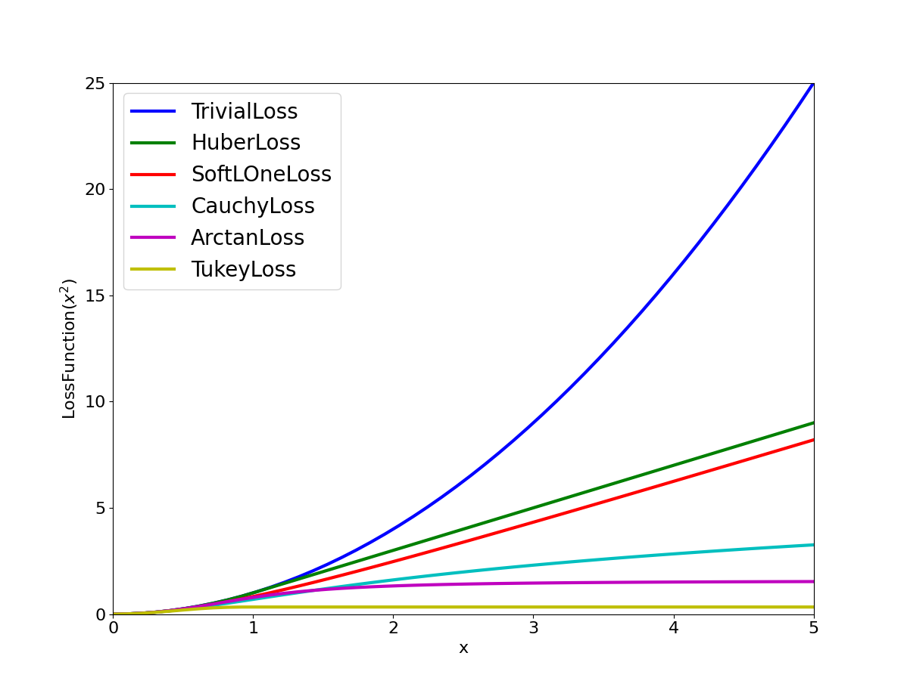

.. `_chapter-modeling`:

========
Modeling
========

Introduction
------------

Ceres solves robustified non-linear least squares problems of the form

.. math:: \frac{1}{2}\sum_{i=1} \rho_i\left(\left\|f_i\left(x_{i_1}, ... ,x_{i_k}\right)\right\|^2\right).
   :label: ceresproblem

The term
:math:`\rho_i\left(\left\|f_i\left(x_{i_1},...,x_{i_k}\right)\right\|^2\right)`
is known as a residual block, where :math:`f_i(\cdot)` is a cost
function that depends on the parameter blocks
:math:`\left[x_{i_1},... , x_{i_k}\right]` and :math:`\rho_i` is a
loss function. In most optimization problems small groups of scalars
occur together. For example the three components of a translation
vector and the four components of the quaternion that define the pose
of a camera. We refer to such a group of small scalars as a
``ParameterBlock``. Of course a ``ParameterBlock`` can just have a
single parameter.

``CostFunction``
----------------

Given parameter blocks :math:`\left[x_{i_1}, ... , x_{i_k}\right]`, a
``CostFunction`` is responsible for computing a vector of residuals
and if asked a vector of Jacobian matrices, i.e., given
:math:`\left[x_{i_1}, ... , x_{i_k}\right]`, compute the vector
:math:`f_i\left(x_{i_1},...,x_{i_k}\right)` and the matrices

.. math:: J_{ij} = \frac{\partial}{\partial x_{i_j}}f_i\left(x_{i_1},...,x_{i_k}\right),\quad \forall j \in \{i_1,..., i_k\}

.. code-block:: c++

 class CostFunction {
  public:
   virtual bool Evaluate(double const* const* parameters,
                         double* residuals,
                         double** jacobians) = 0;
   const vector<int16>& parameter_block_sizes();
   int num_residuals() const;

  protected:
   vector<int16>* mutable_parameter_block_sizes();
   void set_num_residuals(int num_residuals);
 };

The signature of the function (number and sizes of input parameter
blocks and number of outputs) is stored in ``parameter_block_sizes_``
and ``num_residuals_`` respectively. User code inheriting from this
class is expected to set these two members with the corresponding
accessors. This information will be verified by the Problem when added
with ``Problem::AddResidualBlock``.

The most important method here is ``Evaluate``. It implements the
residual and Jacobian computation.

``parameters`` is an array of pointers to arrays containing the
various parameter blocks. parameters has the same number of elements
as ``parameter_block_sizes_``.  Parameter blocks are in the same order
as ``parameter_block_sizes_``.

``residuals`` is an array of size ``num_residuals_``.

``jacobians`` is an array of size ``parameter_block_sizes_``
containing pointers to storage for Jacobian matrices corresponding to
each parameter block. The Jacobian matrices are in the same order as
``parameter_block_sizes_``. ``jacobians[i]`` is an array that contains
``num_residuals_ x parameter_block_sizes_[i]`` elements. Each Jacobian
matrix is stored in row-major order, i.e., ``jacobians[i][r *
parameter_block_size_[i] + c]`` = :math:`\frac{\partial
residual[r]}{\partial parameters[i][c]}`

If ``jacobians`` is ``NULL``, then no derivatives are returned; this is
the case when computing cost only. If ``jacobians[i]`` is ``NULL``, then
the Jacobian matrix corresponding to the :math:`i^{\textrm{th}}`
parameter block must not be returned, this is the case when the a
parameter block is marked constant.

``SizedCostFunction``
---------------------

If the size of the parameter blocks and the size of the residual
vector is known at compile time (this is the common case), Ceres
provides ``SizedCostFunction``, where these values can be specified as
template parameters.

.. code-block:: c++

 template<int kNumResiduals,
          int N0 = 0, int N1 = 0, int N2 = 0, int N3 = 0, int N4 = 0, int N5 = 0>
 class SizedCostFunction : public CostFunction {
  public:
   virtual bool Evaluate(double const* const* parameters,
                         double* residuals,
                         double** jacobians) = 0;
 };

In this case the user only needs to implement the ``Evaluate`` method.

``AutoDiffCostFunction``
------------------------

But even defining the ``SizedCostFunction`` can be a tedious affair if
complicated derivative computations are involved. To this end Ceres
provides automatic differentiation.

To get an auto differentiated cost function, you must define a class
with a templated ``operator()`` (a functor) that computes the cost
function in terms of the template parameter ``T``. The autodiff
framework substitutes appropriate ``Jet`` objects for ``T`` in order to
compute the derivative when necessary, but this is hidden, and you
should write the function as if ``T`` were a scalar type (e.g. a
double-precision floating point number).

The function must write the computed value in the last argument (the
only non-``const`` one) and return true to indicate success.

For example, consider a scalar error :math:`e = k - x^\top y`, where
both :math:`x` and :math:`y` are two-dimensional vector parameters and
:math:`k` is a constant. The form of this error, which is the
difference between a constant and an expression, is a common pattern
in least squares problems. For example, the value :math:`x^\top y`
might be the model expectation for a series of measurements, where
there is an instance of the cost function for each measurement
:math:`k`.

The actual cost added to the total problem is :math:`e^2`, or
:math:`(k - x^\top y)^2`; however, the squaring is implicitly done by
the optimization framework.

To write an auto-differentiable cost function for the above model,
first define the object

.. code-block:: c++

 class MyScalarCostFunction {
   MyScalarCostFunction(double k): k_(k) {}
   template <typename T>
   bool operator()(const T* const x , const T* const y, T* e) const {
     e[0] = T(k_) - x[0] * y[0] - x[1] * y[1];
     return true;
   }

  private:
   double k_;
 };

Note that in the declaration of ``operator()`` the input parameters
``x`` and ``y`` come first, and are passed as const pointers to arrays
of ``T``. If there were three input parameters, then the third input
parameter would come after ``y``. The output is always the last
parameter, and is also a pointer to an array. In the example above,
``e`` is a scalar, so only ``e[0]`` is set.

Then given this class definition, the auto differentiated cost
function for it can be constructed as follows.

.. code-block:: c++

 CostFunction* cost_function
     = new AutoDiffCostFunction<MyScalarCostFunction, 1, 2, 2>(
         new MyScalarCostFunction(1.0));              ^  ^  ^
                                                      |  |  |
                          Dimension of residual ------+  |  |
                          Dimension of x ----------------+  |
                          Dimension of y -------------------+

In this example, there is usually an instance for each measurement of
``k``.

In the instantiation above, the template parameters following
``MyScalarCostFunction``, ``<1, 2, 2>`` describe the functor as
computing a 1-dimensional output from two arguments, both
2-dimensional.

The framework can currently accommodate cost functions of up to 6
independent variables, and there is no limit on the dimensionality of
each of them.

**WARNING 1** Since the functor will get instantiated with different
types for ``T``, you must convert from other numeric types to ``T`` before
mixing computations with other variables oftype ``T``. In the example
above, this is seen where instead of using ``k_`` directly, ``k_`` is
wrapped with ``T(k_)``.

**WARNING 2** A common beginner's error when first using
``AutoDiffCostFunction`` is to get the sizing wrong. In particular,
there is a tendency to set the template parameters to (dimension of
residual, number of parameters) instead of passing a dimension
parameter for *every parameter block*. In the example above, that
would be ``<MyScalarCostFunction, 1, 2>``, which is missing the 2 as the
last template argument.

Theory & Implementation
^^^^^^^^^^^^^^^^^^^^^^^

``NumericDiffCostFunction``
---------------------------

To get a numerically differentiated cost function, define a subclass
of ``CostFunction`` such that the ``Evaluate`` function ignores the
jacobian parameter. The numeric differentiation wrapper will fill in
the jacobians array if necessary by repeatedly calling the ``Evaluate``
method with small changes to the appropriate parameters, and computing
the slope. For performance, the numeric differentiation wrapper class
is templated on the concrete cost function, even though it could be
implemented only in terms of the virtual ``CostFunction`` interface.

.. code-block:: c++

 template <typename CostFunctionNoJacobian,
           NumericDiffMethod method = CENTRAL, int M = 0,
           int N0 = 0, int N1 = 0, int N2 = 0, int N3 = 0, int N4 = 0, int N5 = 0>
 class NumericDiffCostFunction
     : public SizedCostFunction<M, N0, N1, N2, N3, N4, N5> {
 };

The numerically differentiated version of a cost function for a cost function
can be constructed as follows:

.. code-block:: c++

 CostFunction* cost_function
     = new NumericDiffCostFunction<MyCostFunction, CENTRAL, 1, 4, 8>(
         new MyCostFunction(...), TAKE_OWNERSHIP);

where ``MyCostFunction`` has 1 residual and 2 parameter blocks with sizes 4 and 8
respectively. Look at the tests for a more detailed example.

The central difference method is considerably more accurate at the cost of
twice as many function evaluations than forward difference. Consider using
central differences begin with, and only after that works, trying forward
difference to improve performance.

``Loss Function``
-----------------

For least squares problems where the minimization may encounter input
terms that contain outliers, that is, completely bogus measurements,
it is important to use a loss function that reduces their influence.

Consider a structure from motion problem. The unknowns are 3D points
and camera parameters, and the measurements are image coordinates
describing the expected reprojected position for a point in a
camera. For example, we want to model the geometry of a street scene
with fire hydrants and cars, observed by a moving camera with unknown
parameters, and the only 3D points we care about are the pointy
tippy-tops of the fire hydrants. Our magic image processing algorithm,
which is responsible for producing the measurements that are input to
Ceres, has found and matched all such tippy-tops in all image frames,
except that in one of the frame it mistook a car's headlight for a
hydrant. If we didn't do anything special the residual for the
erroneous measurement will result in the entire solution getting
pulled away from the optimum to reduce the large error that would
otherwise be attributed to the wrong measurement.

Using a robust loss function, the cost for large residuals is
reduced. In the example above, this leads to outlier terms getting
down-weighted so they do not overly influence the final solution.

.. code-block:: c++

 class LossFunction {
  public:
   virtual void Evaluate(double s, double out[3]) const = 0;
 };

The key method is ``Evaluate``, which given a non-negative scalar ``s``,
computes

.. math::

	out = \begin{bmatrix}\rho(s), & \rho'(s), & \rho''(s)\end{bmatrix}

Here the convention is that the contribution of a term to the cost
function is given by :math:`\frac{1}{2}\rho(s)`, where :math:`s
=\|f_i\|^2`. Calling the method with a negative value of :math:`s` is
an error and the implementations are not required to handle that case.

Most sane choices of :math:`\rho` satisfy:

.. math::

   \rho(0) &= 0\\
   \rho'(0) &= 1\\
   \rho'(s) &< 1 \text{ in the outlier region}\\
   \rho''(s) &< 0 \text{ in the outlier region}

so that they mimic the squared cost for small residuals.

Scaling
^^^^^^^

Given one robustifier :math:`\rho(s)` one can change the length scale
at which robustification takes place, by adding a scale factor
:math:`a > 0` which gives us :math:`\rho(s,a) = a^2 \rho(s / a^2)` and
the first and second derivatives as :math:`\rho'(s / a^2)` and
:math:`(1 / a^2) \rho''(s / a^2)` respectively.

   Shape of the various common loss functions.

The reason for the appearance of squaring is that :math:`a` is in the
units of the residual vector norm whereas :math:`s` is a squared
norm. For applications it is more convenient to specify :math:`a` than
its square.

Here are some common loss functions implemented in Ceres. For
simplicity we described their unscaled versions. Figure~\ref{fig:loss}
illustrates their shape graphically.

1. ``NullLoss``

.. math:: \rho(s) = s

2. ``HuberLoss``

.. math:: \rho(s) = \begin{cases} s & s \le 1\\ 2 \sqrt{s} - 1 & s > 1
   \end{cases}

3. ``SoftLOneLoss``

.. math:: \rho(s) = 2 (\sqrt{1+s} - 1)

4. ``CauchyLoss``

.. math:: \rho(s) = \log(1 + s)

Ceres includes a number of other loss functions, the descriptions and
documentation for which can be found in ``include/ceres/loss_function.h``.

Theory & Implementation
^^^^^^^^^^^^^^^^^^^^^^^

Let us consider a problem with a single problem and a single parameter
block.

.. math::

 \min_x \frac{1}{2}\rho(f^2(x))

Then, the robustified gradient and the Gauss-Newton Hessian are

.. math::

	g(x) &= \rho'J^\top(x)f(x)\\
	H(x) &= J^\top(x)\left(\rho' + 2 \rho''f(x)f^\top(x)\right)J(x)

where the terms involving the second derivatives of :math:`f(x)` have
been ignored. Note that :math:`H(x)` is indefinite if
:math:`\rho''f(x)^\top f(x) + \frac{1}{2}\rho' < 0`. If this is not
the case, then its possible to re-weight the residual and the Jacobian
matrix such that the corresponding linear least squares problem for
the robustified Gauss-Newton step.

Let :math:`\alpha` be a root of

.. math:: \frac{1}{2}\alpha^2 - \alpha - \frac{\rho''}{\rho'}\|f(x)\|^2 = 0.

Then, define the rescaled residual and Jacobian as

.. math::

	\tilde{f}(x) &= \frac{\sqrt{\rho'}}{1 - \alpha} f(x)\\
	\tilde{J}(x) &= \sqrt{\rho'}\left(1 - \alpha
 	                \frac{f(x)f^\top(x)}{\left\|f(x)\right\|^2} \right)J(x)

In the case :math:`2 \rho''\left\|f(x)\right\|^2 + \rho' \lesssim 0`,
we limit :math:`\alpha \le 1- \epsilon` for some small
:math:`\epsilon`. For more details see [Triggs]_.

With this simple rescaling, one can use any Jacobian based non-linear
least squares algorithm to robustifed non-linear least squares
problems.

``LocalParameterization``
-------------------------

Sometimes the parameters :math:`x` can overparameterize a problem. In
that case it is desirable to choose a parameterization to remove the
null directions of the cost. More generally, if :math:`x` lies on a
manifold of a smaller dimension than the ambient space that it is
embedded in, then it is numerically and computationally more effective
to optimize it using a parameterization that lives in the tangent
space of that manifold at each point.

For example, a sphere in three dimensions is a two dimensional
manifold, embedded in a three dimensional space. At each point on the
sphere, the plane tangent to it defines a two dimensional tangent
space. For a cost function defined on this sphere, given a point
:math:`x`, moving in the direction normal to the sphere at that point
is not useful. Thus a better way to parameterize a point on a sphere
is to optimize over two dimensional vector :math:`\Delta x` in the
tangent space at the point on the sphere point and then "move" to the
point :math:`x + \Delta x`, where the move operation involves
projecting back onto the sphere. Doing so removes a redundant
dimension from the optimization, making it numerically more robust and
efficient.

More generally we can define a function

.. math:: x' = \boxplus(x, \Delta x),

where :math:`x` has the same size as :math:`x`, and :math:`\Delta x` is of size less
than or equal to :math:`x`. The function :math:`\boxplus`, generalizes the
definition of vector addition. Thus it satisfies the identity

.. math:: \boxplus(x, 0) = x,\quad \forall x.

Instances of ``LocalParameterization`` implement the :math:`\boxplus`
operation and its derivative with respect to :math:`\Delta x` at
:math:`\Delta x = 0`.

.. code-block:: c++

 class LocalParameterization {
  public:
   virtual ~LocalParameterization() {}
   virtual bool Plus(const double* x,
                     const double* delta,
                     double* x_plus_delta) const = 0;
   virtual bool ComputeJacobian(const double* x, double* jacobian) const = 0;
   virtual int GlobalSize() const = 0;
   virtual int LocalSize() const = 0;
 };

``GlobalSize`` is the dimension of the ambient space in which the
parameter block :math:`x` lives. ``LocalSize`` is the size of the
tangent space that :math:`\Delta x` lives in. ``Plus`` implements
:math:`\boxplus(x,\Delta x)` and ``ComputeJacobian`` computes the
Jacobian matrix

.. math:: J = \left . \frac{\partial }{\partial \Delta x} \boxplus(x,\Delta x)\right|_{\Delta x = 0}

in row major form. A trivial version of :math:`\boxplus` is when delta is of the same size as :math:`x`
and

.. math::  \boxplus(x, \Delta x) = x + \Delta x

A more interesting case if :math:`x` is a two dimensional vector, and
the user wishes to hold the first coordinate constant. Then,
:math:`\Delta x` is a scalar and :math:`\boxplus` is defined as

.. math::

  \boxplus(x, \Delta x) = x + \left[ \begin{array}{c} 0 \\ 1
                                  \end{array} \right]        \Delta x

``SubsetParameterization`` generalizes this construction to hold any
part of a parameter block constant.

Another example that occurs commonly in Structure from Motion problems
is when camera rotations are parameterized using a quaternion. There,
it is useful only to make updates orthogonal to that 4-vector defining
the quaternion. One way to do this is to let :math:`\Delta x` be a 3
dimensional vector and define :math:`\boxplus` to be

.. math:: \boxplus(x, \Delta x) = \left[ \cos(|\Delta x|), \frac{\sin\left(|\Delta x|\right)}{|\Delta x|} \Delta x \right] * x
   :label: quaternion

The multiplication between the two 4-vectors on the right hand side is
the standard quaternion product. ``QuaternionParameterization`` is an
implementation of :eq:`quaternion`.

``Problem``
-----------

.. code-block:: c++

 class Problem {
  public:
   struct Options {
     Options();
     Ownership cost_function_ownership;
     Ownership loss_function_ownership;
     Ownership local_parameterization_ownership;
   };

   Problem();
   explicit Problem(const Options& options);
   ~Problem();

   ResidualBlockId AddResidualBlock(CostFunction* cost_function,
                                    LossFunction* loss_function,
                                    const vector<double*>& parameter_blocks);

   void AddParameterBlock(double* values, int size);
   void AddParameterBlock(double* values,
                          int size,
                          LocalParameterization* local_parameterization);

   void SetParameterBlockConstant(double* values);
   void SetParameterBlockVariable(double* values);
   void SetParameterization(double* values,
                            LocalParameterization* local_parameterization);

   int NumParameterBlocks() const;
   int NumParameters() const;
   int NumResidualBlocks() const;
   int NumResiduals() const;
 };

The ``Problem`` objects holds the robustified non-linear least squares
problem :eq:`ceresproblem`. To create a least squares problem,
use the ``Problem::AddResidualBlock`` and ``Problem::AddParameterBlock``
methods.

For example a problem containing 3 parameter blocks of sizes 3, 4 and 5
respectively and two residual blocks  of size 2 and 6:

.. code-block:: c++

 double x1[] = { 1.0, 2.0, 3.0 };
 double x2[] = { 1.0, 2.0, 3.0, 5.0 };
 double x3[] = { 1.0, 2.0, 3.0, 6.0, 7.0 };

 Problem problem;
 problem.AddResidualBlock(new MyUnaryCostFunction(...), x1);
 problem.AddResidualBlock(new MyBinaryCostFunction(...), x2, x3);

``AddResidualBlock`` as the name implies, adds a residual block to the
problem. It adds a ``CostFunction`` , an optional ``LossFunction`` and
connects the ``CostFunction`` to a set of parameter block.

The cost function carries with it information about the sizes of the
parameter blocks it expects. The function checks that these match the
sizes of the parameter blocks listed in ``parameter_blocks``. The
program aborts if a mismatch is detected. ``loss_function`` can be
``NULL``, in which case the cost of the term is just the squared norm of
the residuals.

The user has the option of explicitly adding the parameter blocks
using ``AddParameterBlock``. This causes additional correctness
checking; however, ``AddResidualBlock`` implicitly adds the parameter
blocks if they are not present, so calling ``AddParameterBlock``
explicitly is not required.

``Problem`` by default takes ownership of the ``cost_function`` and
``loss_function`` pointers. These objects remain live for the life of
the ``Problem`` object. If the user wishes to keep control over the
destruction of these objects, then they can do this by setting the
corresponding enums in the ``Problem::Options`` struct.

Note that even though the Problem takes ownership of ``cost_function``
and ``loss_function``, it does not preclude the user from re-using
them in another residual block. The destructor takes care to call
delete on each ``cost_function`` or ``loss_function`` pointer only
once, regardless of how many residual blocks refer to them.

``AddParameterBlock`` explicitly adds a parameter block to the
``Problem``. Optionally it allows the user to associate a
``LocalParameterization`` object with the parameter block
too. Repeated calls with the same arguments are ignored. Repeated
calls with the same double pointer but a different size results in
undefined behaviour.

You can set any parameter block to be constant using
``SetParameterBlockConstant`` and undo this using
``SetParameterBlockVariable``.

In fact you can set any number of parameter blocks to be constant, and
Ceres is smart enough to figure out what part of the problem you have
constructed depends on the parameter blocks that are free to change
and only spends time solving it. So for example if you constructed a
problem with a million parameter blocks and 2 million residual blocks,
but then set all but one parameter blocks to be constant and say only
10 residual blocks depend on this one non-constant parameter
block. Then the computational effort Ceres spends in solving this
problem will be the same if you had defined a problem with one
parameter block and 10 residual blocks.

Ownership
^^^^^^^^^

``Problem`` by default takes ownership of the ``cost_function``,
``loss_function`` and ``local_parameterization`` pointers. These
objects remain live for the life of the ``Problem``. If the user
wishes to keep control over the destruction of these objects, then
they can do this by setting the corresponding enums in the
``Problem::Options`` struct.

Even though ``Problem`` takes ownership of these pointers, it does not
preclude the user from re-using them in another residual or parameter
block. The destructor takes care to call delete on each pointer only
once.
