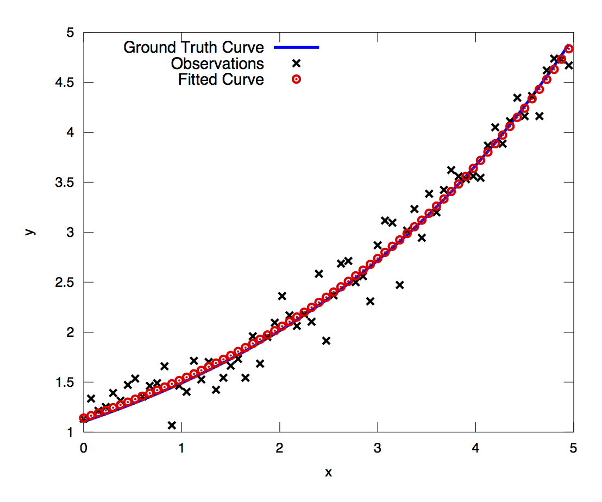

.. _chapter-tutorial:

========
Tutorial
========

.. highlight:: c++

.. _section-hello-world:

Hello World!
============

To get started, let us consider the problem of finding the minimum of
the function

.. math:: \frac{1}{2}(10 -x)^2.

This is a trivial problem, whose minimum is located at :math:`x = 10`,
but it is a good place to start to illustrate the basics of solving a
problem with Ceres [#f1]_.

Let us write this problem as a non-linear least squares problem by
defining the scalar residual function :math:`f_1(x) = 10 - x`. Then
:math:`F(x) = [f_1(x)]` is a residual vector with exactly one
component.

When solving a problem with Ceres, the first thing to do is to define
a subclass of CostFunction. It is responsible for computing
the value of the residual function and its derivative (also known as
the Jacobian) with respect to :math:`x`.

.. code-block:: c++

 class SimpleCostFunction : public ceres::SizedCostFunction<1, 1> {
  public:
   virtual ~SimpleCostFunction() {}
   virtual bool Evaluate(double const* const* parameters,
                         double* residuals,
                         double** jacobians) const {
     const double x = parameters[0][0];
     residuals[0] = 10 - x;

     // Compute the Jacobian if asked for.
     if (jacobians != NULL && jacobians[0] != NULL) {
       jacobians[0][0] = -1;
     }
     return true;
   }
 };

SimpleCostFunction is provided with an input array of
parameters, an output array for residuals and an optional output array
for Jacobians. In our example, there is just one parameter and one
residual and this is known at compile time, therefore we can save some
code and instead of inheriting from CostFunction, we can
instaed inherit from the templated SizedCostFunction class.

The jacobians array is optional, Evaluate is expected to check when it
is non-null, and if it is the case then fill it with the values of the
derivative of the residual function. In this case since the residual
function is linear, the Jacobian is constant.

Once we have a way of computing the residual vector, it is now time to
construct a Non-linear least squares problem using it and have Ceres
solve it.

.. code-block:: c++

 int main(int argc, char** argv) {
   double x = 5.0;
   ceres::Problem problem;

   // The problem object takes ownership of the newly allocated
   // SimpleCostFunction and uses it to optimize the value of x.
   problem.AddResidualBlock(new SimpleCostFunction, NULL, &x);

   // Run the solver!
   Solver::Options options;
   options.max_num_iterations = 10;
   options.linear_solver_type = ceres::DENSE_QR;
   options.minimizer_progress_to_stdout = true;
   Solver::Summary summary;
   Solve(options, &problem, &summary);
   std::cout << summary.BriefReport() << "\n";
   std::cout << "x : 5.0 -> " << x << "\n";
   return 0;
 }

Compiling and running the program gives us

.. code-block:: bash

   0: f: 1.250000e+01 d: 0.00e+00 g: 5.00e+00 h: 0.00e+00 rho: 0.00e+00 mu: 1.00e+04 li:  0 it: 0.00e+00 tt: 0.00e+00
   1: f: 1.249750e-07 d: 1.25e+01 g: 5.00e-04 h: 5.00e+00 rho: 1.00e+00 mu: 3.00e+04 li:  1 it: 0.00e+00 tt: 0.00e+00
   2: f: 1.388518e-16 d: 1.25e-07 g: 1.67e-08 h: 5.00e-04 rho: 1.00e+00 mu: 9.00e+04 li:  1 it: 0.00e+00 tt: 0.00e+00
 Ceres Solver Report: Iterations: 2, Initial cost: 1.250000e+01, Final cost: 1.388518e-16, Termination: PARAMETER_TOLERANCE.
 x : 5.0 -> 10

Starting from a :math:`x=5`, the solver in two iterations goes to 10
[#f2]_. The careful reader will note that this is a linear problem and
one linear solve should be enough to get the optimal value.  The
default configuration of the solver is aimed at non-linear problems,
and for reasons of simplicity we did not change it in this example. It
is indeed possible to obtain the solution to this problem using Ceres
in one iteration. Also note that the solver did get very close to the
optimal function value of 0 in the very first iteration. We will
discuss these issues in greater detail when we talk about convergence
and parameter settings for Ceres.

.. rubric:: Footnotes

.. [#f1] Full working code for this and other
   examples in this manual can be found in the examples directory. Code
   for this example can be found in ``examples/quadratic.cc``.

.. [#f2] Actually the solver ran for three iterations, and it was
   by looking at the value returned by the linear solver in the third
   iteration, it observed that the update to the parameter block was too
   small and declared convergence. Ceres only prints out the display at
   the end of an iteration, and terminates as soon as it detects
   convergence, which is why you only see two iterations here and not
   three.

.. _section-powell:

Powell's Function
=================

Consider now a slightly more complicated example -- the minimization
of Powell's function. Let :math:`x = \left[x_1, x_2, x_3, x_4 \right]`
and

.. math::

  \begin{align}
     f_1(x) &= x_1 + 10x_2 \\
     f_2(x) &= \sqrt{5}  (x_3 - x_4)\\
     f_3(x) &= (x_2 - 2x_3)^2\\
     f_4(x) &= \sqrt{10}  (x_1 - x_4)^2\\
     F(x) & = \left[f_1(x),\ f_2(x),\ f_3(x),\ f_4(x) \right]
  \end{align}

:math:`F(x)` is a function of four parameters, and has four
residuals. Now, one way to solve this problem would be to define four
CostFunction objects that compute the residual and Jacobians. e.g. the
following code shows the implementation for :math:`f_4(x)`.

.. code-block:: c++

 class F4 : public ceres::SizedCostFunction<1, 4> {
  public:
   virtual ~F4() {}
   virtual bool Evaluate(double const* const* parameters,
                         double* residuals,
                         double** jacobians) const {
     double x1 = parameters[0][0];
     double x4 = parameters[0][3];

     residuals[0] = sqrt(10.0) * (x1 - x4) * (x1 - x4)

     if (jacobians != NULL) {
       jacobians[0][0] = 2.0 * sqrt(10.0) * (x1 - x4);
       jacobians[0][1] = 0.0;
       jacobians[0][2] = 0.0;
       jacobians[0][3] = -2.0 * sqrt(10.0) * (x1 - x4);
     }
     return true;
   }
 };

But this can get painful very quickly, especially for residuals
involving complicated multi-variate terms. Ceres provides two ways
around this problem. Numeric and automatic symbolic differentiation.

Automatic Differentiation
-------------------------

With its automatic differentiation support, Ceres allows you to define
templated objects/functors that will compute the ``residual`` and it
takes care of computing the Jacobians as needed and filling the
``jacobians`` arrays with them. For example, for :math:`f_4(x)` we
define

.. code-block:: c++

 class F4 {
  public:
   template <typename T> bool operator()(const T* const x1,
                                         const T* const x4,
                                         T* residual) const {
     residual[0] = T(sqrt(10.0)) * (x1[0] - x4[0]) * (x1[0] - x4[0]);
     return true;
   }
 };

The important thing to note here is that ``operator()`` is a templated
method, which assumes that all its inputs and outputs are of some type
``T``. The reason for using templates here is because Ceres will call
``F4::operator<T>()``, with ``T=double`` when just the residual is
needed, and with a special type ``T=Jet`` when the Jacobians are
needed.

Note also that the parameters are not packed
into a single array, they are instead passed as separate arguments to
``operator()``. Similarly we can define classes ``F1``,``F2``
and ``F4``.  Then let us consider the construction and solution
of the problem. For brevity we only describe the relevant bits of
code [#f3]_ .

.. code-block:: c++

  double x1 =  3.0; double x2 = -1.0; double x3 =  0.0; double x4 =  1.0;
  // Add residual terms to the problem using the using the autodiff
  // wrapper to get the derivatives automatically.
  problem.AddResidualBlock(
    new ceres::AutoDiffCostFunction<F1, 1, 1, 1>(new F1), NULL, &x1, &x2);
  problem.AddResidualBlock(
    new ceres::AutoDiffCostFunction<F2, 1, 1, 1>(new F2), NULL, &x3, &x4);
  problem.AddResidualBlock(
    new ceres::AutoDiffCostFunction<F3, 1, 1, 1>(new F3), NULL, &x2, &x3)
  problem.AddResidualBlock(
    new ceres::AutoDiffCostFunction<F4, 1, 1, 1>(new F4), NULL, &x1, &x4);

A few things are worth noting in the code above. First, the object
being added to the ``Problem`` is an ``AutoDiffCostFunction`` with
``F1``, ``F2``, ``F3`` and ``F4`` as template parameters. Second, each
``ResidualBlock`` only depends on the two parameters that the
corresponding residual object depends on and not on all four
parameters.

Compiling and running ``powell.cc`` gives us:

.. code-block:: bash

 Initial x1 = 3, x2 = -1, x3 = 0, x4 = 1
    0: f: 1.075000e+02 d: 0.00e+00 g: 1.55e+02 h: 0.00e+00 rho: 0.00e+00 mu: 1.00e+04 li:  0 it: 0.00e+00 tt: 0.00e+00
    1: f: 5.036190e+00 d: 1.02e+02 g: 2.00e+01 h: 2.16e+00 rho: 9.53e-01 mu: 3.00e+04 li:  1 it: 0.00e+00 tt: 0.00e+00
    2: f: 3.148168e-01 d: 4.72e+00 g: 2.50e+00 h: 6.23e-01 rho: 9.37e-01 mu: 9.00e+04 li:  1 it: 0.00e+00 tt: 0.00e+00
    3: f: 1.967760e-02 d: 2.95e-01 g: 3.13e-01 h: 3.08e-01 rho: 9.37e-01 mu: 2.70e+05 li:  1 it: 0.00e+00 tt: 0.00e+00
    4: f: 1.229900e-03 d: 1.84e-02 g: 3.91e-02 h: 1.54e-01 rho: 9.37e-01 mu: 8.10e+05 li:  1 it: 0.00e+00 tt: 0.00e+00
    5: f: 7.687123e-05 d: 1.15e-03 g: 4.89e-03 h: 7.69e-02 rho: 9.37e-01 mu: 2.43e+06 li:  1 it: 0.00e+00 tt: 0.00e+00
    6: f: 4.804625e-06 d: 7.21e-05 g: 6.11e-04 h: 3.85e-02 rho: 9.37e-01 mu: 7.29e+06 li:  1 it: 0.00e+00 tt: 0.00e+00
    7: f: 3.003028e-07 d: 4.50e-06 g: 7.64e-05 h: 1.92e-02 rho: 9.37e-01 mu: 2.19e+07 li:  1 it: 0.00e+00 tt: 0.00e+00
    8: f: 1.877006e-08 d: 2.82e-07 g: 9.54e-06 h: 9.62e-03 rho: 9.37e-01 mu: 6.56e+07 li:  1 it: 0.00e+00 tt: 0.00e+00
    9: f: 1.173223e-09 d: 1.76e-08 g: 1.19e-06 h: 4.81e-03 rho: 9.37e-01 mu: 1.97e+08 li:  1 it: 0.00e+00 tt: 0.00e+00
   10: f: 7.333425e-11 d: 1.10e-09 g: 1.49e-07 h: 2.40e-03 rho: 9.37e-01 mu: 5.90e+08 li:  1 it: 0.00e+00 tt: 0.00e+00
   11: f: 4.584044e-12 d: 6.88e-11 g: 1.86e-08 h: 1.20e-03 rho: 9.37e-01 mu: 1.77e+09 li:  1 it: 0.00e+00 tt: 0.00e+00
 Ceres Solver Report: Iterations: 12, Initial cost: 1.075000e+02, Final cost: 4.584044e-12, Termination: GRADIENT_TOLERANCE.
 Final x1 = 0.00116741, x2 = -0.000116741, x3 = 0.000190535, x4 = 0.000190535

It is easy to see that the optimal solution to this problem is at
:math:`x_1=0, x_2=0, x_3=0, x_4=0` with an objective function value of
:math:`0`. In 10 iterations, Ceres finds a solution with an objective
function value of :math:`4\times 10^{-12}`.

Numeric Differentiation
-----------------------

In some cases, its not possible to define a templated cost functor. In
such a situation, numerical differentiation can be used. The user
defines a functor which computes the residual value and construct a
``NumericDiffCostFunction`` using it. e.g., for ``F4``, the
corresponding functor would be

.. code-block:: c++

  class F4 {
   public:
    bool operator()(const double* const x1,
                    const double* const x4,
                    double* residual) const {
      residual[0] = sqrt(10.0) * (x1[0] - x4[0]) * (x1[0] - x4[0]);
      return true;
    }
  };

Which can then be wrapped ``NumericDiffCostFunction`` and added to the
``Problem`` as follows

.. code-block:: c++

  problem.AddResidualBlock(
    new ceres::NumericDiffCostFunction<F4, ceres::CENTRAL, 1, 1, 1>(new F4), NULL, &x1, &x4);

The construction looks almost identical to the used for automatic
differentiation, except for an extra template parameter that indicates
the kind of finite differencing scheme to be used for computing the
numerical derivatives. ``examples/quadratic_numeric_diff.cc`` shows a
numerically differentiated implementation of
``examples/quadratic.cc``.

**We recommend that if possible, automatic differentiation should be
used. The use of C++ templates makes automatic differentiation
extremely efficient, whereas numeric differentiation can be quite
expensive, prone to numeric errors and leads to slower convergence.**

.. rubric:: Footnotes

.. [#f3] The full source code for this example can be found in ``examples/powell.cc``.

.. _section-fitting:

Curve Fitting
=============

The examples we have seen until now are simple optimization problems
with no data. The original purpose of least squares and non-linear
least squares analysis was fitting curves to data. It is only
appropriate that we now consider an example of such a problem
[#f4]_. It contains data generated by sampling the curve :math:`y =
e^{0.3x + 0.1}` and adding Gaussian noise with standard deviation
:math:`\sigma = 0.2`.}. Let us fit some data to the curve

.. math::  y = e^{mx + c}.

We begin by defining a templated object to evaluate the
residual. There will be a residual for each observation.

.. code-block:: c++

 class ExponentialResidual {
  public:
   ExponentialResidual(double x, double y)
       : x_(x), y_(y) {}

   template <typename T> bool operator()(const T* const m,
                                         const T* const c,
                                         T* residual) const {
     residual[0] = T(y_) - exp(m[0] * T(x_) + c[0]);
     return true;
   }

  private:
   // Observations for a sample.
   const double x_;
   const double y_;
 };

Assuming the observations are in a :math:`2n` sized array called ``data``
the problem construction is a simple matter of creating a
``CostFunction`` for every observation.

.. code-block:: c++

 double m = 0.0;
 double c = 0.0;

 Problem problem;
 for (int i = 0; i < kNumObservations; ++i) {
   problem.AddResidualBlock(
       new AutoDiffCostFunction<ExponentialResidual, 1, 1, 1>(
           new ExponentialResidual(data[2 * i], data[2 * i + 1])),
       NULL,
       &m, &c);
 }

Compiling and running ``data_fitting.cc`` gives us:

.. code-block:: bash

    0: f: 1.211734e+02 d: 0.00e+00 g: 3.61e+02 h: 0.00e+00 rho: 0.00e+00 mu: 1.00e+04 li:  0 it: 0.00e+00 tt: 0.00e+00
    1: f: 1.211734e+02 d:-2.21e+03 g: 3.61e+02 h: 7.52e-01 rho:-1.87e+01 mu: 5.00e+03 li:  1 it: 0.00e+00 tt: 0.00e+00
    2: f: 1.211734e+02 d:-2.21e+03 g: 3.61e+02 h: 7.51e-01 rho:-1.86e+01 mu: 1.25e+03 li:  1 it: 0.00e+00 tt: 0.00e+00
    3: f: 1.211734e+02 d:-2.19e+03 g: 3.61e+02 h: 7.48e-01 rho:-1.85e+01 mu: 1.56e+02 li:  1 it: 0.00e+00 tt: 0.00e+00
    4: f: 1.211734e+02 d:-2.02e+03 g: 3.61e+02 h: 7.22e-01 rho:-1.70e+01 mu: 9.77e+00 li:  1 it: 0.00e+00 tt: 0.00e+00
    5: f: 1.211734e+02 d:-7.34e+02 g: 3.61e+02 h: 5.78e-01 rho:-6.32e+00 mu: 3.05e-01 li:  1 it: 0.00e+00 tt: 0.00e+00
    6: f: 3.306595e+01 d: 8.81e+01 g: 4.10e+02 h: 3.18e-01 rho: 1.37e+00 mu: 9.16e-01 li:  1 it: 0.00e+00 tt: 0.00e+00
    7: f: 6.426770e+00 d: 2.66e+01 g: 1.81e+02 h: 1.29e-01 rho: 1.10e+00 mu: 2.75e+00 li:  1 it: 0.00e+00 tt: 0.00e+00
    8: f: 3.344546e+00 d: 3.08e+00 g: 5.51e+01 h: 3.05e-02 rho: 1.03e+00 mu: 8.24e+00 li:  1 it: 0.00e+00 tt: 0.00e+00
    9: f: 1.987485e+00 d: 1.36e+00 g: 2.33e+01 h: 8.87e-02 rho: 9.94e-01 mu: 2.47e+01 li:  1 it: 0.00e+00 tt: 0.00e+00
   10: f: 1.211585e+00 d: 7.76e-01 g: 8.22e+00 h: 1.05e-01 rho: 9.89e-01 mu: 7.42e+01 li:  1 it: 0.00e+00 tt: 0.00e+00
   11: f: 1.063265e+00 d: 1.48e-01 g: 1.44e+00 h: 6.06e-02 rho: 9.97e-01 mu: 2.22e+02 li:  1 it: 0.00e+00 tt: 0.00e+00
   12: f: 1.056795e+00 d: 6.47e-03 g: 1.18e-01 h: 1.47e-02 rho: 1.00e+00 mu: 6.67e+02 li:  1 it: 0.00e+00 tt: 0.00e+00
   13: f: 1.056751e+00 d: 4.39e-05 g: 3.79e-03 h: 1.28e-03 rho: 1.00e+00 mu: 2.00e+03 li:  1 it: 0.00e+00 tt: 0.00e+00
 Ceres Solver Report: Iterations: 13, Initial cost: 1.211734e+02, Final cost: 1.056751e+00, Termination: FUNCTION_TOLERANCE.
 Initial m: 0 c: 0
 Final   m: 0.291861 c: 0.131439

Starting from parameter values :math:`m = 0, c=0` with an initial
objective function value of :math:`121.173` Ceres finds a solution
:math:`m= 0.291861, c = 0.131439` with an objective function value of
:math:`1.05675`. These values are a a bit different than the
parameters of the original model :math:`m=0.3, c= 0.1`, but this is
expected. When reconstructing a curve from noisy data, we expect to
see such deviations. Indeed, if you were to evaluate the objective
function for :math:`m=0.3, c=0.1`, the fit is worse with an objective
function value of :math:`1.082425`.  The figure below illustrates the fit.

   Least squares data fitting to the curve :math:`y = e^{0.3x +
   0.1}`. Observations were generated by sampling this curve uniformly
   in the interval :math:`x=(0,5)` and adding Gaussian noise with
   :math:`\sigma = 0.2`.

.. rubric:: Footnotes

.. [#f4] The full source code for this example can be found in ``examples/data_fitting.cc``.

Bundle Adjustment
=================

One of the main reasons for writing Ceres was our need to solve large
scale bundle adjustment
problems [HartleyZisserman]_, [Triggs]_.

Given a set of measured image feature locations and correspondences,
the goal of bundle adjustment is to find 3D point positions and camera
parameters that minimize the reprojection error. This optimization
problem is usually formulated as a non-linear least squares problem,
where the error is the squared :math:`L_2` norm of the difference between
the observed feature location and the projection of the corresponding
3D point on the image plane of the camera. Ceres has extensive support
for solving bundle adjustment problems.

Let us consider the solution of a problem from the `BAL <http://grail.cs.washington.edu/projects/bal/>`_ dataset [#f5]_.

The first step as usual is to define a templated functor that computes
the reprojection error/residual. The structure of the functor is
similar to the ``ExponentialResidual``, in that there is an
instance of this object responsible for each image observation.

Each residual in a BAL problem depends on a three dimensional point
and a nine parameter camera. The nine parameters defining the camera
can are: Three for rotation as a Rodriquez axis-angle vector, three
for translation, one for focal length and two for radial distortion.
The details of this camera model can be found on Noah Snavely's
`Bundler homepage <http://phototour.cs.washington.edu/bundler/>`_
and the `BAL homepage <http://grail.cs.washington.edu/projects/bal/>`_.

.. code-block:: c++

 struct SnavelyReprojectionError {
   SnavelyReprojectionError(double observed_x, double observed_y)
       : observed_x(observed_x), observed_y(observed_y) {}
   template <typename T>
   bool operator()(const T* const camera,
                   const T* const point,
                   T* residuals) const {
     // camera[0,1,2] are the angle-axis rotation.
     T p[3];
     ceres::AngleAxisRotatePoint(camera, point, p);
     // camera[3,4,5] are the translation.
     p[0] += camera[3]; p[1] += camera[4]; p[2] += camera[5];

     // Compute the center of distortion. The sign change comes from
     // the camera model that Noah Snavely's Bundler assumes, whereby
     // the camera coordinate system has a negative z axis.
     T xp = - p[0] / p[2];
     T yp = - p[1] / p[2];

     // Apply second and fourth order radial distortion.
     const T& l1 = camera[7];
     const T& l2 = camera[8];
     T r2 = xp*xp + yp*yp;
     T distortion = T(1.0) + r2  * (l1 + l2  * r2);

     // Compute final projected point position.
     const T& focal = camera[6];
     T predicted_x = focal * distortion * xp;
     T predicted_y = focal * distortion * yp;

     // The error is the difference between the predicted and observed position.
     residuals[0] = predicted_x - T(observed_x);
     residuals[1] = predicted_y - T(observed_y);
     return true;
   }
   double observed_x;
   double observed_y;
 } ;

Note that unlike the examples before this is a non-trivial function
and computing its analytic Jacobian is a bit of a pain. Automatic
differentiation makes our life very simple here. The function
``AngleAxisRotatePoint`` and other functions for manipulating
rotations can be found in ``include/ceres/rotation.h``.

Given this functor, the bundle adjustment problem can be constructed
as follows:

.. code-block:: c++

 // Create residuals for each observation in the bundle adjustment problem. The
 // parameters for cameras and points are added automatically.
 ceres::Problem problem;
 for (int i = 0; i < bal_problem.num_observations(); ++i) {
   // Each Residual block takes a point and a camera as input and outputs a 2
   // dimensional residual. Internally, the cost function stores the observed
   // image location and compares the reprojection against the observation.
   ceres::CostFunction* cost_function =
       new ceres::AutoDiffCostFunction<SnavelyReprojectionError, 2, 9, 3>(
           new SnavelyReprojectionError(
               bal_problem.observations()[2 * i + 0],
               bal_problem.observations()[2 * i + 1]));
   problem.AddResidualBlock(cost_function,
                            NULL /* squared loss */,
                            bal_problem.mutable_camera_for_observation(i),
                            bal_problem.mutable_point_for_observation(i));
 }

Again note that that the problem construction for bundle adjustment is
very similar to the curve fitting example.

One way to solve this problem is to set
``Solver::Options::linear_solver_type`` to
``SPARSE_NORMAL_CHOLESKY`` and call ``Solve``. And while
this is a reasonable thing to do, bundle adjustment problems have a
special sparsity structure that can be exploited to solve them much
more efficiently. Ceres provides three specialized solvers
(collectively known as Schur based solvers) for this task. The example
code uses the simplest of them ``DENSE_SCHUR``.

.. code-block:: c++

 ceres::Solver::Options options;
 options.linear_solver_type = ceres::DENSE_SCHUR;
 options.minimizer_progress_to_stdout = true;
 ceres::Solver::Summary summary;
 ceres::Solve(options, &problem, &summary);
 std::cout << summary.FullReport() << "\n";

For a more sophisticated bundle adjustment example which demonstrates
the use of Ceres' more advanced features including its various linear
solvers, robust loss functions and local parameterizations see
``examples/bundle_adjuster.cc``.

.. rubric:: Footnotes

.. [#f5] The full source code for this example can be found in ``examples/simple_bundle_adjuster.cc``.
