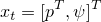
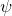
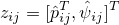
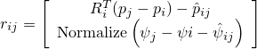
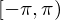
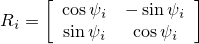
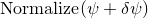

Pose Graph 2D
----------------

A pose graph optimization problem falls into the class of problems of
Simultaneous Localization and Mapping (SLAM). The SLAM problem consists of
building a map of an unknown environment while simultaneously localizing against
this map. The main difficulty of this problem stems from not having any
additional external aiding information such as GPS. SLAM has been considered one
of the fundamental challenges of robotics. There are many resources on SLAM. A
general tutorial on graph-based SLAM algorithms is provided in [1].

This package defines the necessary Ceres cost functions, with analytical
Jacobians, needed to model the pose graph optimization problem as well as a
binary to build and solve the problem. The code is fully united tested. The
following explains how to formulate the traditional graph-based SLAM problem in
2-Dimensions with relative pose constraints.

Consider a robot moving in a 2-Dimensional plane. The robot has access to a set
of sensors such as wheel odometry or a laser range scanner. From these raw
measurements, we want estimate the trajectory of the robot as well as build map
of the environment. In order to reduce the computational complexity of the
problem, the pose graph approach abstracts the raw measurements away.
Specifically, it creates a graph of nodes which represent the pose of the robot,
and edges which represent the relative transformation (delta position and
orientation) between the two nodes. The edges are virtual measurements derived
from the raw sensor measurements, e.g. by integrating the raw wheel odometry or
aligning the laser range scans acquired from the robot. A visualization of the
resulting graph is shown below.


The figure depicts the pose of the robot as the triangles, the measurements are
indicated by the connecting lines, and the loop closure measurements are shown
as dotted lines. Loop closures are measurements between non-sequential robot
states and they reduce the accumulation of error over time. The following will
describe the mathematical formulation of the pose graph problem.

The robot at timestamp t has state  where
p is a 2D vector that represents the x-y position and
 is the orientation in radians. The
measurement of the relative transform between the robot state at two timestamps
i and j is given as: . The residual
implemented in the Ceres cost function which computes the error between the
measurement and the predicted measurement is:

,

where the function `Normalize(.)` normalizes the angle in the range
, and R is the rotation matrix given by

.

To finish the cost function, we need to weight the residual by the uncertainty
of the measurement. Hence, we pre-multiply the residual by the square root of
the information matrix for the measurement.

Lastly, we use a local parameterization to normalize the orientation in the
range which is normalized between .
Specially, we define the `LocalParameterization::Plus` function to be:
.

Running
-----------
This package includes an executable `pose_graph_2d` that will read a problem
definition file. This executable can work with any 2D problem definition that
uses the g2o format. It would be relatively straightforward to implement a new
reader for a different format such as toro or others. `pose_graph_2d` will print
the Ceres solver full summary and then output to disk the original and optimized
poses (`poses_original.txt` and `poses_optimized.txt`, respectively) of the
robot in the following format:

```
pose_id x y yaw_radians
pose_id x y yaw_radians
pose_id x y yaw_radians
...
```

where `pose_id` is the corresponding integer ID from the file definition. Note,
the file will be sorted in ascending order for the `pose_id`.

The executable `solve_pose_graph_2d` expects the first argument to be the path
to the problem definition. To run the executable,

```
/path/to/bin/pose_graph_2d /path/to/dataset/dataset.g2o
```

where this assumes the install directory is located in the repository.

A python script is provided to visualize the resulting output files.
```
/path/to/repo/robotics/slam/pose_graph_2d/plot_results.py --poses_optimized_filename ./poses_optimized.txt --poses_original_filename ./poses_original.txt
```

As an example, a standard synthetic benchmark dataset [2] created by Edwin Olson
which has 3500 nodes in a grid world with a total of 5598 edges was solved.
Visualizing the results with the provided script produces:


with the original poses in green and the optimized poses in blue. As shown, the
optimized poses more closely match the underlying grid world. Note, the left
side of the graph has a small yaw drift due to a lack of relative constraints to
provide enough information to reconstruct the trajectory.

References
--
[1]  Giorgio Grisetti, Rainer Kummerle, Cyrill Stachniss, Wolfram Burgard. A
Tutorial on Graph-Based SLAM. IEEE Intelligent Transportation Systems Magazine,
52(3):199–222, 2010.

[2] E. Olson, J. Leonard, and S. Teller, “Fast iterative optimization of
pose graphs with poor initial estimates,” in Robotics and Automation
(ICRA), IEEE International Conference on, 2006, pp. 2262–2269.
